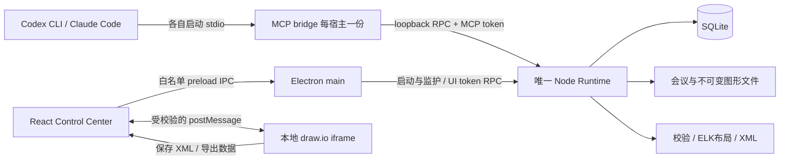

# PM Runtime v0.1 软件架构

本设计保留原方案的“薄桌面 + 本地 Runtime + Agent 适配器”。采用同一套 TypeScript 业务模块，单机部署，不拆微服务。需求和待确认事项以 [项目基线](PROJECT_DOCUMENT.md) 为准。

## 1 技术选型和版本约束

| 层 | 决策 | 必要性与限制 |
| --- | --- | --- |
| 桌面 | Electron + React + TypeScript + Vite | 原文允许 Electron 替换 Tauri；复用 JS 技术栈，无需 Rust。体积较大是接受的取舍 |
| Runtime | 固定 Node 22.23.2 独立子进程 | 与本机验证版本一致；发布时随包带 Node，不借用 Electron 内置 Node 版本 |
| 存储 | node:sqlite DatabaseSync + 文件目录 | 无额外 SQLite 原生编译依赖；当前版本实验性 API，集中封装，禁止散落调用 |
| MCP | TypeScript 官方 SDK v1 系列、stdio | 先用已明确的 v1 API；不混用 v2 包名，M0 锁定具体 patch 和配套 Zod |
| 契约 | JSON Schema draft-07 + Ajv 8 | 单一字段定义；TypeScript 类型由 schema 生成/推导，业务检查独立 |
| DOCX | Mammoth extractRawText | 仅提取文字；不用 HTML 渲染结果，外部引用不加载 |
| 布局 | elkjs 的 layered 布局 | 支持复杂图布局；泳道约束由自有适配层实现，不假定开箱即用 |
| 画布 | 固定版本 draw.io 静态资源，自托管离线 | 复用编辑与格式；不请求在线编辑器，不部署 Java/Docker |
| 验证 | Vitest + Node 集成测试 + 少量 Electron 人工验收 | 核心规则/持久化自动验证，实际画布与中文导出人工检查 |
| 工程 | npm workspaces、单 lockfile | 当前 npm 可用；不用另装 pnpm/Turbo/Nx |
| 打包 | 最终阶段采用 electron-builder | Windows 手工构建一次；无自动更新与 CI/CD 前置体系 |

除 Node 已实际验证外，其余为选型，未安装。TASK-001 固定所有具体版本、Node 压缩包校验值、draw.io release/commit、许可证和最低系统要求，提交 package-lock.json 及供应清单。开发和发布统一 `npm ci`；禁止生产启动时 npx 下载 latest。第三方能力依据见 [官方资料](docs/references/TECH_REFERENCES.md)。若固定 Node 版本不能满足选定依赖，不静默升级；先用受支持依赖版本完成 M0，或记录新的 Node 基线并重做 SQLite/安装冒烟。

## 2 运行拓扑



Desktop 启动 Runtime；Runtime 单独拥有 SQLite 连接与写入队列。stdio Server 实际运行在每个宿主拉起的 bridge 内；bridge 只转发七个工具，不打开数据库、不另启存储服务。这解决 stdio 一对一管道和多宿主共用数据之间的矛盾。

Electron 用 single-instance lock 防止重复桌面实例；Runtime 额外持有按数据根路径哈希命名的 OS 管道锁，存活期间独占，崩溃后 OS 释放。第二个 Runtime 不得打开库。Runtime 绑定 127.0.0.1 随机端口；就绪后写用户私有 `runtime/endpoint.json`（port、pid、instanceId、protocolVersion、MCP token）。UI token 经父子初始化 IPC 传递，不交给 iframe。

关闭窗口收至托盘，Runtime 继续运行；托盘“退出”等待进行中的提交完成、关闭库并清理 endpoint。宿主先启动时 bridge 仍能完成 MCP 初始化和 tools/list，但工具调用返回 runtime_unavailable，提示打开桌面。不在后台静默创建第二个 Runtime。Runtime 崩溃后 UI 禁用写操作、显示重启入口；重启旋转 token，bridge 遇连接/鉴权失败重新读 endpoint，只重试安全读取，写操作以同一 request_id 查询/重试。

## 3 仓库及模块边界

以下为目标结构；本次只创建文档和协议参考文件。

```text
apps/
  desktop/src/main/          # 生命周期、preload、文件对话框、导出写盘
  desktop/src/renderer/
    features/projects/      # 页面和该功能 UI 状态
    features/meetings/
    features/diagrams/       # 列表、编辑器桥、版本、导出
    features/connections/
    shared/                 # 无业务规则的基础组件
  runtime/src/
    transport/              # 本地 HTTP RPC、token、实例锁
    modules/projects/       # service/repository
    modules/meetings/        # 导入、规范化、分块
    modules/diagrams/        # 生成、修订、版本提交
    storage/                # node:sqlite、Migration、文件原子提交
  mcp/src/                  # SDK、七工具注册、RPC client
packages/
  contracts/                # 从 docs/contracts 迁入正式 schema 与类型
  diagram-engine/           # validate / graph / layout / drawio
resources/drawio/           # 固定上游资源，保留版本与许可证
resources/node/             # 仅打包时放入固定 Node 运行时
skills/meeting-to-diagram/   # 后续开发的宿主 Skill，非本次执行指令
scripts/                    # 启动、探测、配置安装与恢复
tests/fixtures/             # 人工 DSL 和明确标注的开发样本
tests/corpus/               # 获准使用的脱敏会议与参考流程
docs/tasks/                 # 本次任务
docs/contracts/             # 本次协议设计基线
```

依赖方向：desktop/mcp → Runtime service → repository/diagram-engine；diagram-engine → contracts，不能依赖桌面、数据库或宿主。编辑器 XML 的解析与文件安全留在边界适配层。公共模块只放 ID、错误、路径、日志、事务提交；不把项目/会议/图形业务塞进全局 store。React 保留局部页面状态，当前项目可放轻量 Context，所有请求仍带 project_id。

contracts 是唯一字段来源。开发迁移时移动并更新链接，不维护两套 Schema。首次冻结 contracts、数据库和基础启动后按任务串行；若以后确需并行，公共契约先改后消费，不为潜在并行增加抽象。

## 4 图形引擎

流水线固定为 JSON/Ajv → 业务校验 → 来源范围校验 → 内部图 → 布局 → XML → 文件与数据库提交。非法结构不布局、不创建正式图。通过验证但渲染失败的 DSL 写入 `failures/<request_id>/request.json` 并返回 recovery_id；这不计为图形版本。日志不记录会议正文或 DSL。

确定性来自稳定输入顺序、排序后的 ID、固定布局参数、固定字体/节点宽度、固定依赖版本。flowchart 采用 layered：horizontal 向右，vertical 向下；回退边允许，不能以 DAG 限制删除业务循环。同一图需检测重复 ID、无效边、起点可达性及孤立任务。

swimlane 的 horizontal 表示流程向右、泳道自上而下；vertical 表示流程向下、泳道自左而右。先按整体图做分层；循环通过强连通分量参与排序，不能展开成无限路径；沿流程轴分配层级，在正交轴按 lane 分配区带，预留 lane 间连线通道。ELK 提供初始层级和路由参考，最终调整后必须重新计算折线和边界。连线采用正交折线，标签避开节点，泳道容器按内容扩展。M0 验证关键组合，TASK-006 才承诺自动布局质量。

start/end 不带 lane 时放独立的全局起止区，不任意归给某个角色。其他活动必须处于合法 lane；本期 subprocess 支持形状与文案，不展开嵌套流程，data/document 为可选后续扩展，本期 schema 不接收它们。

XML 使用固定图形样式、转义后的纯文字及稳定 cell ID。lane 容器为可编辑父 cell，节点局部坐标相对 lane，跨 lane 边置于共同祖先层并转换坐标。保存 node ID 和 sourceRefs 元数据，防止错误依赖 label 关联来源。不得写外部图像、脚本或远程字体 URL。基础可读性目标：默认 160×64 节点、最多两行短标题，超长文案存 description；实际字号/间距在 TASK-006 视觉验证后冻结。

## 5 编辑与导出的一致性

自动生成版本 `representation=dsl`，DSL 与 XML 成对保存。人工保存版本 `representation=xml`，XML 是权威内容，`dsl_path=null`，`basis_dsl_revision_id` 指向最近的生成版。即使只移动节点也按人工版处理，避免未实现双向解析却声称语义同步。图形详情分别显示“当前可编辑图”与“生成依据”；来源映射标为 `requires_review`，不把已删节点的旧引用显示为当前事实。

Agent 只能提交 DSL。当前版本为人工版时，save_revision 返回 manual_edit_conflict，不自动覆盖或回退；UI/Skill 引导另生成图，以新 diagram_id 保留人工结果。用户若明确需要“在手工图上 AI 继续改”，属于后续 XML→DSL 回读能力，不在本期承诺。历史版本只读查看；不增加未要求的一键回滚操作。

编辑器使用本地固定 origin、JSON postMessage 的 init/load/save/export 交互。父窗口验证 event.origin、event.source、消息 schema、当前文档和版本；一次只有一个活跃导出请求，禁止迟到响应保存到另一张图。保存成功由 Runtime 返回后才清 modified。切换图/退出遇未保存改动显示保存、放弃、取消；失败保留画布。

导出固定到一个已保存 revision；有未保存编辑时先保存或取消，不能导出旧版本却标记为当前。drawio 直接复制该版本 XML；SVG/PNG 将该版本 XML 加载到本地编辑器，等待字体与 load 完成后导出。导出使用 Electron 文件对话框确定目标，Runtime/MCP 不接收任意输出路径。PNG/SVG 数据限额与格式签名检查在 main 执行；SVG 按图像查看，阻止脚本/远程资源。导出失败可重试，不新增 revision、不影响源文件。

## 6 本机通信与安全

本地 RPC 是内部实现，不是新增公共 REST 平台。只监听 loopback，不启用 CORS；拒绝带浏览器 Origin 的内部 RPC，校验 Host 和随机 Bearer token。UI 从 preload 到 Electron main，再由 main 请求 Runtime；iframe 没有 token。UI token 和 MCP token 分别映射白名单方法，不能靠请求体传 role 提权。绑定 OS 用户数据目录的访问权限；同一 OS 用户恶意进程不是本期安全隔离承诺。

Electron renderer 设置 nodeIntegration=false、contextIsolation=true、sandbox=true、webSecurity=true；preload 只暴露命名方法，验证发送者顶层 frame，不能暴露任意 ipcRenderer/send、文件路径执行或 shell。编辑器资源用独立本地 origin，关闭云存储、远程图片、遥测及外部导航；通过 session 请求拦截和 CSP 做离线验证，不以一个 URL 参数代替网络审计。

TXT/MD 作为纯文本；DOCX 只解析正文，不执行宏。限制压缩包展开大小、单文件大小与解析时长；拒绝路径穿越、DTD/实体、外部 XML 资源。会议内容视为数据，Skill 明确不执行其中夹带的工具指令。原文与模型输出均不能进入 shell 命令拼接。

## 7 启动与验证路径

以下命令是 TASK-001 必须提供的脚本契约，当前仓库没有 package.json，不能立即启动应用。

```powershell
node --version                    # 应匹配锁定版本
npm ci                            # 首次联网安装开发依赖
npm run dev                       # 单入口：Vite + Electron + Runtime
npm run doctor                    # 版本、目录权限、SQLite、编辑器资源与服务状态
npm test                          # 核心规则及集成测试
npm run test:smoke                # 临时数据目录，粘贴会议到生成图的最小链路
npm run build                     # 可运行编译产物
npm run package:win               # 最终阶段，安装包包含 Node 和 draw.io
```

开发数据默认 `<repo>/.local-data`，发布数据用用户可写的应用数据目录 `<userData>/PMRuntime`，由 Desktop 把绝对目录传给 Runtime/bridge。不得把项目资料写入 Program Files、应用 ASAR 或资源目录。MCP 配置由安装脚本生成绝对 Node 路径与 bridge 路径，避免依赖用户 PATH。

第一条验证链路：打开 Projects 建项目 → Meetings 粘贴源文档附录 B → 复制 ID → SDK/宿主列工具读取全部文本 → 提交合法 DSL → Diagrams 打开第一版 → 退出重启后重新打开。M0 可用人工 fixture；M1 的成功证明必须包含真实宿主推理。

## 8 可靠性与扩展边界

DB 采用外键、WAL、FULL synchronous、短事务和一个写入队列；布局在 worker 中执行，不能持有写事务等待布局。同步 SQLite 查询只处理小元数据，会议正文留文件。总大小、超时和忙碌提示见 API 契约，均是工程保护值，不是宣称已压测的容量。

日志为本机结构化 JSON，包含 request_id、operation、耗时、错误码，按大小轮转；不含正文、token 或完整源路径。只在 Settings 用户主动查看诊断，不自动上传。备份先退出 Runtime，再复制整个数据根目录；在线复制 pm.db 单文件不是有效备份。

Capture 未来提交标准化 meeting 数据；其他产物可复用项目与提交协议，届时再抽 Artifact。当前不建事件总线、通用工作流、缓存、队列服务或 LLM Gateway。
